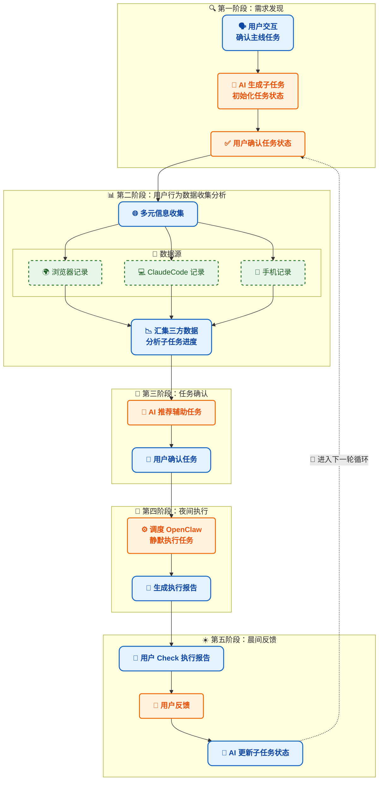

# TimelineForClawd-Flask

用户行为时间轴与任务管理系统

## 项目概述

本项目是一个基于 Flask 的 Web 应用，用于收集用户多端行为数据（Chrome浏览器、Claude Code对话、手机OCR），整合成时间轴，并支持用户任务管理功能。

## 系统架构图



## 技术架构

| 层级 | 技术 |
|------|------|
| 后端 | Python Flask |
| 前端 | HTML + CSS + JavaScript |
| 数据存储 | JSON文件（当前）、支持迁移至SQLite |

## 目录结构

```
TimelineForClawd-Flask/
├── app.py                 # Flask 主应用
├── templates/             # HTML 模板
│   ├── index.html         # 时间轴首页
│   ├── task_input.html    # 任务输入页面
│   ├── task_dashboard.html # 任务仪表盘
│   ├── analysis.html      # AI分析页面
│   └── night_tasks.html   # 夜间任务页面
├── data/                  # 数据存储目录
│   ├── user_tasks.json    # 用户任务配置
│   ├── task_behaviors.json # 行为归类结果
│   ├── night_tasks.json   # 夜间任务队列
│   └── timeline_*.json    # 时间轴数据
├── after_data/            # 处理后的源数据
│   ├── after_chrome.json
│   ├── after_claudecode.json
│   └── after_phoneocr.json
└── requirements.txt       # Python依赖
```

## 核心功能

### 1. 时间轴展示
- 收集多端用户行为数据
- 按时间顺序整合展示
- 支持日期筛选

### 2. 任务管理
- 创建统一任务列表
- 任务状态跟踪（pending/in_progress/completed）
- 支持子任务

### 3. AI 分析
- 将行为数据归类到对应任务
- 分析任务进度
- 生成夜间任务建议

### 4. 夜间任务
- 查看AI建议的任务
- 确认执行任务
- 记录执行结果

## 数据库设计

### 用户任务表 (user_tasks.json)

```json
{
  "tasks": [
    {
      "id": "task_001",
      "name": "完成毕业设计论文",
      "description": "写完第四章系统设计与第五章实现",
      "deadline": "2026-04-15",
      "status": "in_progress",
      "sub_tasks": [
        {
          "id": "sub_001",
          "name": "整理实验数据",
          "status": "completed"
        },
        {
          "id": "sub_002",
          "name": "撰写实验部分",
          "status": "pending"
        }
      ],
      "created_at": "2026-03-30T10:00:00"
    },
    {
      "id": "task_101",
      "name": "提升编程能力",
      "description": "每天刷LeetCode，学习系统设计",
      "status": "in_progress",
      "sub_tasks": [],
      "created_at": "2026-03-30T10:00:00"
    }
  ],
  "created_at": "2026-03-30T10:00:00",
  "updated_at": "2026-03-31T10:00:00"
}
```

### 字段说明

| 字段 | 类型 | 说明 |
|------|------|------|
| id | string | 任务唯一标识 |
| name | string | 任务名称 |
| description | string | 任务描述 |
| deadline | string | 截止日期（短期任务） |
| status | string | 任务状态：pending/in_progress/completed |
| sub_tasks | array | 子任务列表 |
| created_at | string | 创建时间 |

### 子任务结构 (sub_tasks)

```json
{
  "id": "sub_001",
  "name": "子任务名称",
  "status": "pending/completed"
}
```

### 任务行为归类 (task_behaviors.json)

```json
{
  "task_001": {
    "matched_records": [...],
    "progress_percent": 45,
    "last_active": "2026-03-30T20:30:00"
  }
}
```

### 夜间任务队列 (night_tasks.json)

```json
{
  "date": "2026-03-30",
  "tasks": [
    {
      "id": "night_001",
      "task_id": "task_001",
      "description": "搜索相关论文",
      "related_task": "完成毕业设计论文",
      "confirmed": false,
      "executed": false
    }
  ]
}
```

## API 接口

| 接口 | 方法 | 功能 |
|------|------|------|
| `/` | GET | 时间轴首页 |
| `/tasks` | GET | 任务仪表盘 |
| `/input` | GET | 任务输入页面 |
| `/analysis` | GET | AI分析页面 |
| `/api/timeline/<date>` | GET | 获取时间轴数据 |
| `/api/tasks` | GET/POST | 获取/保存任务 |
| `/api/task-behaviors` | GET | 获取行为归类结果 |
| `/api/analyze` | POST | 运行AI分析 |
| `/api/night-tasks` | GET | 获取夜间任务 |
| `/api/night-tasks/<id>/confirm` | POST | 确认夜间任务 |

## 运行方式

```bash
# 进入项目目录
cd /Users/chehaoyuan/Desktop/chrome_extension/TimelineForClawd-Flask

# 安装依赖（如需要）
pip install -r requirements.txt

# 启动应用
python app.py
```

访问 http://127.0.0.1:5000

## 页面说明

| 页面 | 地址 | 功能 |
|------|------|------|
| 时间轴 | `/` | 查看行为时间轴 |
| 任务输入 | `/input` | 添加新任务 |
| 任务仪表盘 | `/tasks` | 查看任务列表和进度 |
| AI分析 | `/analysis` | 运行AI分析 |
| 夜间任务 | `/night-tasks` | 确认和执行夜间任务 |

## 开发计划

### 1. 初始化任务信息收集
- [x] 1.1 前端任务信息收集
- [ ] 1.2 前端的美化
- [x] 1.3 后端任务信息系统构建
- [ ] 1.4 任务信息状态更新

### 2. 用户行为数据收集
- [x] 2.1 三端记录信息收集
- [x] 2.2 三端信息预处理与时间轴生成
- [ ] 2.3 三端信息深入分析

### 3. AI数据分析
- [ ] AI数据分析 -> 归类到任务 -> 归类到任务进度

### 4. AI辅助任务生成
- [ ] AI根据任务进度生成可辅助任务

### 5. OpenClaw集成
- [ ] 可辅助任务与OpenClaw通信

### 6. 任务执行
- [ ] OpenClaw执行与生成报告

### 7. 整体优化
- [ ] 整体check

## 待实现功能

- [ ] SQLite数据库迁移
- [ ] 用户认证
- [ ] 数据可视化增强
- [ ] OpenClaw集成自动执行
